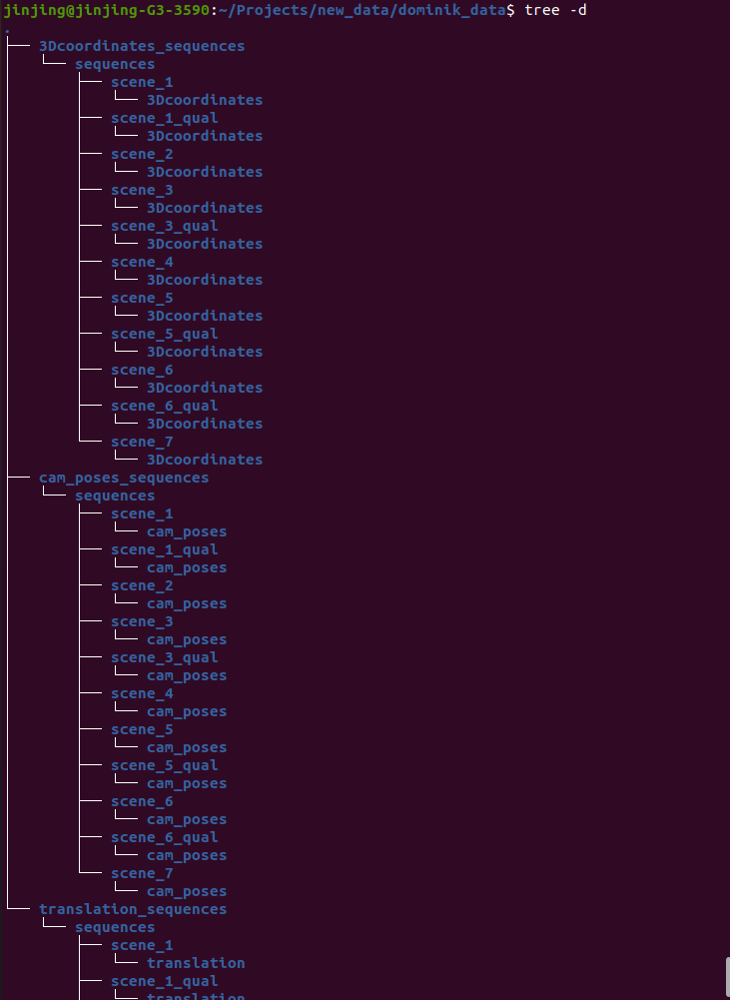

1. download the raw dataset from link under dataset_dir:
we need 3 subdirs: Translations  	Labels: 3D-Coordinates  	Labels: Camera Poses
save them with below structure: 

2. env set up: 
a) env creation: make sure you have installed conda, then prepare the env named everything by running:
conda env create -f /home/jinjing/Projects/detector_sysdata/environment.yml
b) install private package for our project with below commands:
conda activate everything
cd /home/jinjing/Projects/detector_sysdata
python setup.py develop

3. prepare dataset: 
a) edit the related params in /home/jinjing/Projects/detector_sysdata/detectors_eva/utils/args_init.py
params can be edited are under section   # param for data generation
b) data generation: run /home/jinjing/Projects/detector_sysdata/detectors_eva/utils/generate_ofnpy_ovimg.py
this will auto generate 2 more subdirs for opticflow and warp info under dataset_dir in step 1. 

4. metric computation using various feature detectors(superpoint;KP2D; AKAZE; ORB; agastSIFT):
a) the params set we want to evaluted for each method can be edited in /home/jinjing/Projects/detector_sysdata/detectors_eva/utils/args_init.py
b) metric computation: the scripts are under /home/jinjing/Projects/detector_sysdata/examples/
superpoint: run use_sp_torch.py   (use_superpoint.py is for trained tf model )
kp2d: run use_kp2d.py
traditional ones: run use_tradi.py
c) note(optional): some times the evalute has error is due to the groud truth data is damaged, so just regenerate to see if it fix the bug.
d) we can check the result in the auto generated excel file under /home/jinjing/Projects/detector_sysdata/results/eval.xlsx

note: 
a) for speeding up; we also use torch batched data for traditional features metric computation; the batch size can be edited
in args_init.py; Can set to bigger values if the GPU CUDA mem supports.
b) please go through the args_init.py file and change paths etc for your own machine.
